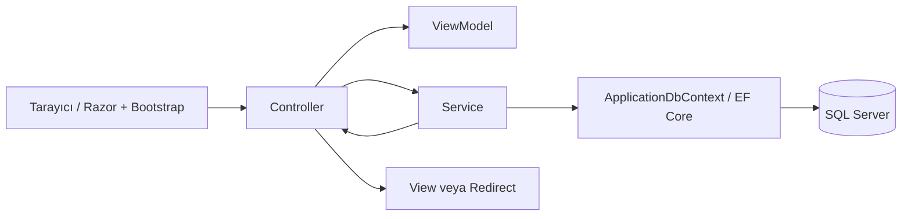

# StockFlow Hedef Mimarisi

Bu belge [ürün spesifikasyonundaki](../product-spec.md) hedef mimariyi görev odaklı özetler. Bugünkü uygulama yapısı için [mevcut durum](current-state.md) esas alınır.

## Mimari biçim

StockFlow tek deploy edilebilir ASP.NET Core MVC monolitidir. Razor ve Bootstrap ince sunucu taraflı UI sağlar; iş kuralları Service sınıflarında, veri erişimi EF Core `ApplicationDbContext` içinde, kalıcı veri SQL Server'da tutulur.

## Sorumluluk sınırları

| Bileşen | Yapar | Yapmaz |
| --- | --- | --- |
| Controller | HTTP/model binding, ViewModel doğrulama, Service çağrısı, sonuç seçimi | İş kuralı veya doğrudan DbContext erişimi |
| Service | Durum geçişi, stok kararı, fiyat güvenliği, transaction sınırı, uygulama akışı | UI üretimi veya HTTP ayrıntısına bağımlılık |
| ApplicationDbContext | Mapping, LINQ sorguları, change tracking ve kalıcılaştırma | İş akışı kararı veya kullanıcı mesajı |
| ViewModel | Güvenli form/ekran sözleşmesi ve giriş doğrulaması | Kalıcı entity görevi |
| Entity | Kalıcı alanlar, ilişkiler ve temel veri şekli | Doğrudan kullanıcı girdisi/response modeli olma |
| Razor View | Kullanıcı arayüzü ve izinli eylemlerin görünürlüğü | İş kuralı veya tek yetkilendirme katmanı olma |

## Kimlik ve yetki

- Hedef kimlik mekanizması cookie tabanlı ASP.NET Core Identity'dir.
- Uygulama rolleri yalnızca `Admin` ve `Employee` değerleridir ve tek sabit kaynaktan kullanılır.
- Seed işlemi idempotent olmalıdır.
- UI görünürlüğü kullanıcı deneyimidir; aynı karar controller/action seviyesinde de zorunlu olarak uygulanır.
- JWT/API Identity zorunlu MVP kapsamında değildir.

## Veri ve transaction sınırı

SQL Server kalıcı kaynaktır. Sipariş onayı; bütün varlık ve stok doğrulamaları tamamlandıktan sonra ürün stokları, `StockMovement` kayıtları ve `Order.Status` değişikliğini tek çalışma birimi/transaction içinde kalıcılaştırır. Hata halinde hiçbir kısmi değişiklik kalmaz.

## Bilinçli olarak eklenmeyecek yapılar

Açık kapsam değişikliği olmadan Clean Architecture, CQRS, MediatR, generic Repository/Unit of Work, AutoMapper, FluentValidation, mikroservis, mesajlaşma, Redis, ayrı SPA/Blazor frontend veya yazma amaçlı Web API eklenmez. EF Core `ApplicationDbContext` veri erişimi için yeterli sınırdır.
