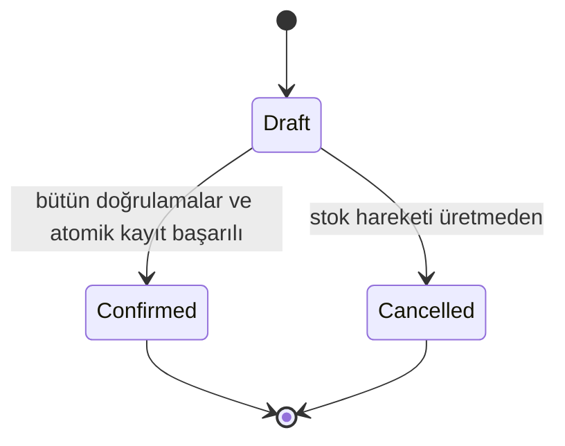

# StockFlow Yüksek Frekanslı Domain Kuralları

Bu dosya uygulama sırasında sık gereken kuralların kısa indeksidir. Eksiksiz ve normatif metin [ürün spesifikasyonudur](../product-spec.md); burada çelişki varsa spesifikasyon geçerlidir.

## Roller

- `Admin`: ürün/kategori ve Supplier yönetimi, sipariş onaylama/iptal, başlangıç kullanıcı/rol verisi dahil tüm yönetim işlemleri.
- `Employee`: dashboard, ürün/kategori görüntüleme, Customer yönetimi, Draft sipariş oluşturma/düzenleme ve stok hareketi görüntüleme.
- Yetki hem UI hem endpoint seviyesinde uygulanır.

## Çekirdek ilişkiler

- Category birden çok Product içerir.
- Product birden çok OrderItem ve StockMovement ile ilişkilidir.
- Order en az bir OrderItem içerir.
- Confirm sırasında oluşan her StockMovement ilgili Order ile ilişkilidir.
- Sale Order yalnızca Customer taşır; Supplier boş olmalıdır.
- Purchase Order yalnızca Supplier taşır; Customer boş olmalıdır.
- OrderItem fiyatı istemciden değil, sipariş anındaki `Product.Price` değerinden alınır.

## Sayısal invariant'lar

- `Product.Sku` benzersizdir.
- `Product.Price > 0`.
- `StockQuantity >= 0` ve `MinimumStockQuantity >= 0`.
- Product oluşturulurken nonnegative başlangıç stoğu kabul edilir ve ilk durum hareket üretmez; standart Product düzenlemesi mevcut `StockQuantity` değerini korur. Sonraki doğrudan stok düzeltmesi, `Adjustment` audit davranışıyla birlikte bonus kapsamıdır.
- `OrderItem.Quantity > 0`.
- `StockMovement.Quantity > 0`; yön `StockIn` veya `StockOut` türüyle belirlenir.
- `Order.TotalAmount`, sunucuda hesaplanan `Quantity × UnitPrice` toplamıdır.

## Sipariş durum makinesi

- Draft oluşturma/düzenleme stok değiştirmez.
- Confirmed ve Cancelled terminaldir; düzenlenmez, yeniden onaylanmaz/açılmaz ve fiziksel olarak silinmez.
- MVP onaylanmış sipariş için reversal davranışı içermez.

## Atomik onay

1. Siparişin var ve Draft olduğu doğrulanır.
2. Taraf, kalem, miktar, Product ve fiyat kuralları doğrulanır.
3. Sale için herhangi bir stok değiştirilmeden önce bütün kalemlerin stok yeterliliği doğrulanır.
4. Purchase için StockIn, Sale için StockOut hareketleri hazırlanır.
5. Stoklar, hareketler ve `Order.Status = Confirmed` tek atomik kayıtta kalıcılaştırılır.
6. Herhangi bir hata siparişi Draft, stokları değişmemiş ve hareket geçmişini boş bırakır.

## Silme politikası

| Kayıt | Fiziksel silme koşulu |
| --- | --- |
| Category | Bağlı Product yoksa |
| Product | OrderItem ve StockMovement geçmişi yoksa |
| Customer | Bağlı Order yoksa |
| Supplier | Bağlı Order yoksa |
| Order | Yalnızca Draft ise |

## Sorgu ve dashboard

- Liste filtreleri ve sayfalama veritabanı sorgusuna yansıtılır; salt-okunur sorgular `AsNoTracking` kullanır.
- Düşük stok: `StockQuantity <= MinimumStockQuantity`.
- Toplam satış yalnızca Confirmed Sale siparişlerini içerir.
- Dashboard boş veritabanında çalışır ve sorguları `DashboardService` içinde tutulur.
