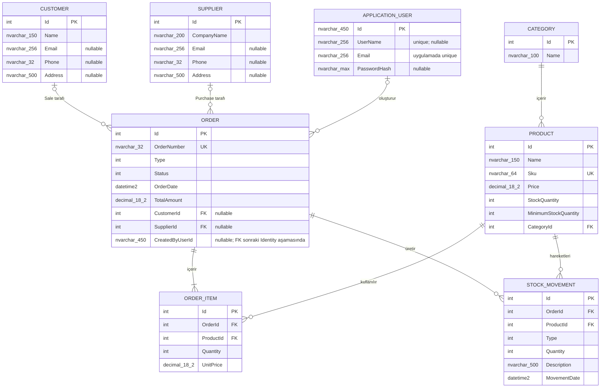

# StockFlow Veritabanı Şeması ve ERD

Bu belge, zorunlu MVP veri modelinin EF Core 10 ve SQL Server üzerindeki fiziksel karşılığını tanımlar. Yedi domain tablosuna ek olarak `ApplicationUser` ve ASP.NET Core Identity destek tabloları aynı `ApplicationDbContext` içinde bulunur. Hedef davranış ve kapsam için [ürün spesifikasyonu](product-spec.md), çalışan gerçek için kod ve migration dosyaları esas alınır.

## Doğrulanan geliştirme ortamı

- Veri kaynağı: `(localdb)\MSSQLLocalDB`
- Veritabanı: `StockFlow`
- Kimlik doğrulama: Windows tümleşik kimlik doğrulaması; parola içeren bağlantı dizesi kullanılmaz.
- Uygulanan migration'lar: `20260818105705_InitialDomainSchema` ve `20260824065853_AddIdentitySchema`
- Canlı şema: yedi domain, yedi Identity tablosu ve `__EFMigrationsHistory`; toplam 14 foreign key, 11 check constraint, 3 benzersiz iş indeksi ve 2 benzersiz Identity indeksi.
- 24 Ağustos 2026 doğrulamasında ikinci migration LocalDB'ye uygulandı ve EF bekleyen model değişikliği bildirmedi.

LocalDB, SQL Server motoruyla migration ve ilişkisel bütünlük pratiği için kullanılır; production veya çok kullanıcılı deployment hedefi değildir.

## ERD

## Fiziksel tablo sözlüğü

| Tablo | Zorunlu alanlar | Nullable alanlar | Temel kurallar |
| --- | --- | --- | --- |
| `Categories` | `Id int IDENTITY`, `Name nvarchar(100)` | Yok | PK `Id` |
| `Products` | `Id`, `Name nvarchar(150)`, `Sku nvarchar(64)`, `Price decimal(18,2)`, `StockQuantity int`, `MinimumStockQuantity int`, `CategoryId` | Yok | SKU benzersiz; fiyat pozitif; stoklar negatif değil |
| `Customers` | `Id`, `Name nvarchar(150)` | `Email nvarchar(256)`, `Phone nvarchar(32)`, `Address nvarchar(500)` | Sipariş geçmişi varken silinmez |
| `Suppliers` | `Id`, `CompanyName nvarchar(200)` | `Email nvarchar(256)`, `Phone nvarchar(32)`, `Address nvarchar(500)` | Sipariş geçmişi varken silinmez |
| `Orders` | `Id`, `OrderNumber nvarchar(32)`, `Type int`, `Status int`, `OrderDate datetime2`, `TotalAmount decimal(18,2)` | `CustomerId`, `SupplierId`, `CreatedByUserId nvarchar(450)` | Numara benzersiz; taraf Type ile uyumlu; toplam pozitif |
| `OrderItems` | `Id`, `OrderId`, `ProductId`, `Quantity int`, `UnitPrice decimal(18,2)` | Yok | Siparişte ürün tek satır; miktar ve fiyat pozitif |
| `StockMovements` | `Id`, `OrderId`, `ProductId`, `Type int`, `Quantity int`, `Description nvarchar(500)`, `MovementDate datetime2` | Yok | Miktar pozitif; tip yalnızca StockIn/StockOut |
| `AspNetUsers` | `Id nvarchar(450)` ve Identity kullanıcı alanları | Identity'nin opsiyonel profil/oturum alanları | `ApplicationUser`; kullanıcı adı benzersiz, e-posta benzersizliği uygulama doğrulamasında zorunlu |
| `AspNetRoles` | `Id nvarchar(450)` | Ad ve concurrency alanları | Normalize rol adı benzersiz; uygulama rolleri `Admin` ve `Employee` |
| Identity destek tabloları | `AspNetRoleClaims`, `AspNetUserClaims`, `AspNetUserLogins`, `AspNetUserRoles`, `AspNetUserTokens` | Identity sözleşmesine göre | Claim, dış login, rol üyeliği ve token ilişkileri |

`OrderDate` ve `MovementDate` için SQL varsayılanı `SYSUTCDATETIME()` değeridir. `OrderType`, `OrderStatus` ve `StockMovementType` değerleri sırasıyla `1..2`, `1..3` ve `1..2` aralıklarında saklanır.

## Anahtarlar, indeksler ve silme davranışı

- `UX_Products_Sku`, `UX_Orders_OrderNumber` ve `UX_OrderItems_OrderId_ProductId` benzersiz indekslerdir.
- `RoleNameIndex` ve `UserNameIndex` standart benzersiz Identity indeksleridir; `EmailIndex` normalize e-posta sorgularını destekler.
- FK ve sorgu indeksleri Category/Product, Customer/Order, Supplier/Order, Order/OrderItem, Product/OrderItem, Order/StockMovement ve Product/StockMovement yollarını kapsar.
- Sipariş sorguları için `(Type, Status, OrderDate)`; hareket geçmişi için `(ProductId, MovementDate)` birleşik indeksleri bulunur.
- Bütün foreign key ilişkileri `Restrict/NoAction` kullanır. Draft siparişin kalemleriyle silinmesi ileride Service katmanında açıkça yönetilecektir.
- `Orders.CreatedByUserId`, nullable `AspNetUsers.Id` foreign key'idir ve kullanıcı silme davranışı `Restrict/NoAction` olarak yapılandırılmıştır.

Identity rolleri ve kullanıcıları migration verisi değildir. Güvenli yapılandırmadan çalışan uygulama başlangıç seeder'ı `Admin` ve `Employee` kayıtlarını idempotent biçimde oluşturur; parola ve e-posta değerleri kaynak kontrollü dosyalarda tutulmaz.

## Uygulama katmanında kalacak kurallar

SQL constraint'leri tek satır ve tek tablo bütünlüğünü korur. Siparişin en az bir kalem içermesi, fiyatın Product kaydından snapshot alınması, toplamın yeniden hesaplanması, terminal durumlar ve atomik stok onayı Service katmanında uygulanacaktır.
