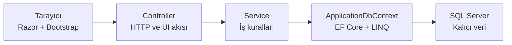
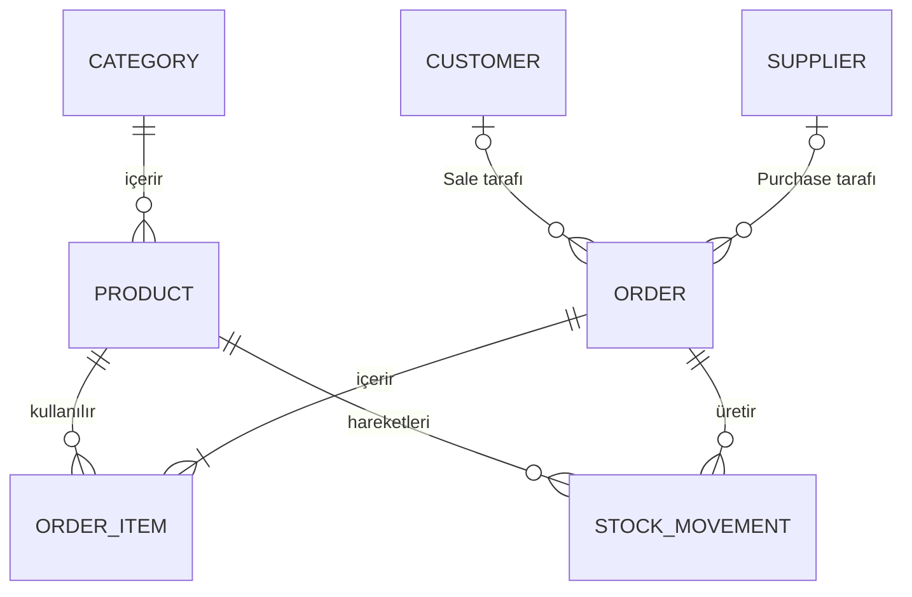
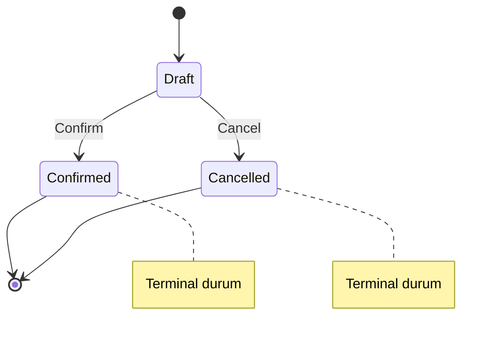
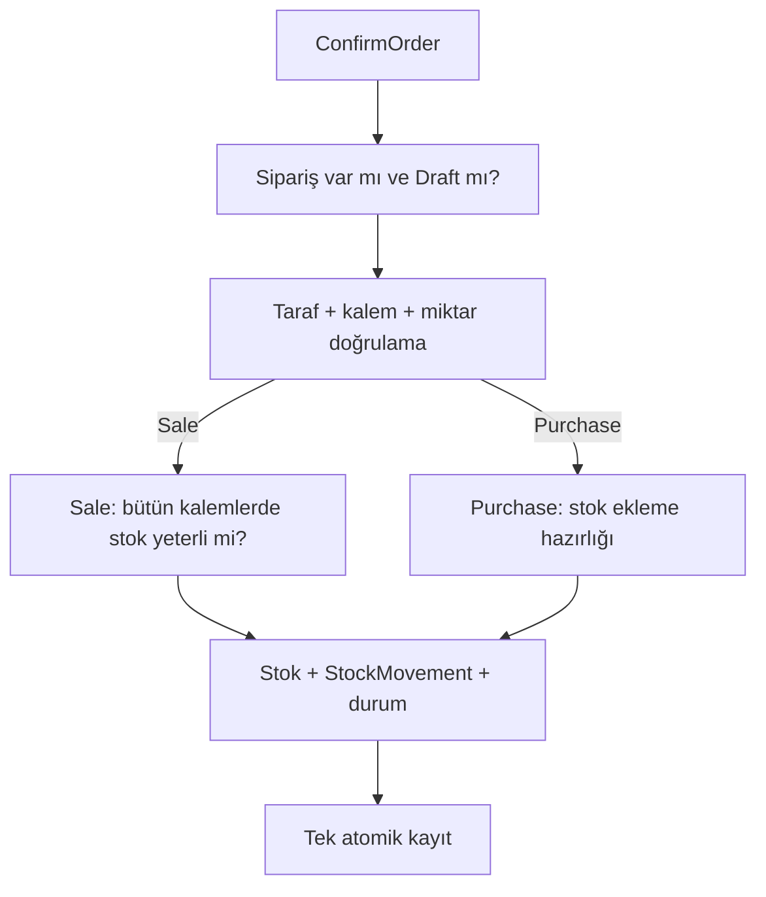

> **Kaynak ve yetki:** Bu Markdown dosyası yapay zekâ ajanları ve geliştiriciler için operasyonel kanonik ürün sözleşmesidir. [StockFlow_Proje_Tanitim_ve_Ozellikler.docx](./StockFlow_Proje_Tanitim_ve_Ozellikler.docx) sürüm 1.1 kaynak anlık görüntüsü olarak korunur. Ürün kapsamı değiştiğinde bu dosya güncellenir; DOCX kendiliğinden güncel kabul edilmez.

> KAPSAM VE GEREKSİNİM BELGESİ

# StockFlow

**Proje Tanıtımı ve Özellik Spesifikasyonu**

Belge amacı: StockFlow'un ne olduğunu, ne yapması gerektiğini ve hangi sınırlar içinde kalacağını tanımlamak

Hedef okuyucu: Projeyi daha sonra geliştirecek yapay zekâ veya teknik uygulayıcı

Kapsam düzeyi: Zorunlu MVP, kabul ölçütleri, bonuslar ve açık kapsam dışı maddeler

Sürüm: 1.1 - 18 Ağustos 2026

> Belgenin sınırı: Bu belge projenin ne olduğunu tanımlar. Günlük çalışma planı, öğrenme rotası, uygulama sırası, kod, pseudocode, klasör ağacı veya dosya bazlı görev içermez.

Temel değer önerisi

StockFlow'un değeri ekran sayısından değil; sipariş onayı sırasında stok bütünlüğünü korumasından, yetkileri ayırmasından ve kritik davranışları testlerle kanıtlamasından gelir.

## İçindekiler

1. [Yönetici Özeti](#1-yönetici-özeti)
2. [Kapsam ve Öncelik Modeli](#2-kapsam-ve-öncelik-modeli)
3. [Teknoloji ve Mimari](#3-teknoloji-ve-mimari)
4. [Kullanıcılar, Roller ve Erişim](#4-kullanıcılar-roller-ve-erişim)
5. [Fonksiyonel Gereksinimler](#5-fonksiyonel-gereksinimler)
6. [Veri Modeli ve Bütünlük Kuralları](#6-veri-modeli-ve-bütünlük-kuralları)
7. [Sipariş ve Stok Sözleşmeleri](#7-sipariş-ve-stok-sözleşmeleri)
8. [Kalite ve İşletim Gereksinimleri](#8-kalite-ve-işletim-gereksinimleri)
9. [Kabul Senaryoları](#9-kabul-senaryoları)
10. [Bonus Kapsam ve Açık Sınırlar](#10-bonus-kapsam-ve-açık-sınırlar)
11. [Terimler ve Nihai Kabul Listesi](#11-terimler-ve-nihai-kabul-listesi)

### Belgenin normatif dili

OKUMA-01 [ZORUNLU] MVP içinde uygulanması gereken davranışı ifade eder.

OKUMA-02 [BONUS] Yalnızca zorunlu MVP temiz biçimde doğrulandıktan sonra açılabilen davranışı ifade eder.

OKUMA-03 [KAPSAM DIŞI] Belirtilen teknoloji veya özellik, ayrıca kapsam değişikliği yapılmadıkça projeye eklenmemelidir.

> Yorumlama kuralı: Belge içinde çelişki oluşursa kritik iş kuralları ve kabul senaryoları, genel tanıtım cümlelerinden daha bağlayıcıdır.

## 1. Yönetici Özeti

StockFlow; küçük veya orta ölçekli bir işletmenin kategori, ürün, tedarikçi, müşteri, satın alma siparişi, satış siparişi ve stok hareketlerini yöneten web tabanlı bir mini ERP uygulamasıdır. Sistem; yönetim ekranlarını, kimlik doğrulamayı ve raporlamayı tek bir ASP.NET Core MVC uygulamasında birleştirir.

Uygulamanın merkezi davranışı sipariş yaşam döngüsüdür. Sipariş önce Draft olarak oluşturulur; Draft aşamasında stok değişmez. Geçerli bir onay işlemi Sale için stoğu azaltır, Purchase için artırır ve her değişikliği StockMovement geçmişine yazar. Onay başarısız olursa hiçbir kısmi değişiklik kalmaz.

> Başarı tanımı: Kimlik ve rol ayrımı, ilişkisel veri bütünlüğü, güvenli sipariş geçişleri, atomik stok etkisi, sorgulanabilir hareket geçmişi, anlamlı dashboard ve kritik xUnit kanıtları birlikte çalışıyorsa MVP başarılıdır.

## 2. Kapsam ve Öncelik Modeli

### 2.1 Zorunlu MVP

Login, logout, yerel kullanıcı hesapları ve Admin/Employee rol ayrımı.

Category, Product, Supplier ve Customer kayıtlarının doğrulamalı yönetimi.

Sale ve Purchase türünde, birden fazla OrderItem içeren Draft siparişler.

Draft siparişler için düzenleme, onaylama ve iptal; terminal durum koruması.

Stok yeterlilik kontrolü, StockIn/StockOut etkisi ve StockMovement geçmişi.

Arama, filtreleme, sıralama, sunucu taraflı sayfalama ve dashboard.

Controller, Service ve ApplicationDbContext arasında açık sorumluluk ayrımı.

Merkezi hata yönetimi, güvenli mesajlar, yapılandırılmış logging ve odaklanmış xUnit testleri.

Temiz kurulum, migration, örnek yapılandırma ve tekrarlanabilir demo/kabul davranışı.

### 2.2 Öncelik kapısı

SCOPE-01 [ZORUNLU] Sipariş onayı ve stok hareketi doğru çalışmıyorsa API, Swagger/OpenAPI, Docker veya deployment kapsamı açılmamalıdır.

SCOPE-02 [ZORUNLU] Bonus geliştirmeler zorunlu MVP'nin davranışını veya MVC akışını bozmamalıdır.

## 3. Teknoloji ve Mimari

### 3.1 Teknoloji sözleşmesi

_Tablo 1. Zorunlu teknoloji seti_

| Teknoloji | Rol | Bu projedeki işlev |
| --- | --- | --- |
| C# | Ana dil | OOP, LINQ, async/await ve exception yönetimi |
| .NET 10 LTS | Platform | Uygulamanın hedef çalışma platformu |
| ASP.NET Core MVC | Web çatısı | Controller, routing, model binding ve middleware |
| Razor + Bootstrap | İnce UI | Backend davranışlarını kullanılabilir kılan sunucu taraflı arayüz |
| EF Core 10 | ORM | İlişkiler, LINQ, migrations ve change tracking |
| EF Core SQL Server Provider | Provider | Microsoft.EntityFrameworkCore.SqlServer paketiyle SQL Server bağlantısı |
| Microsoft SQL Server + SSMS | Veritabanı / yönetim | Kalıcı ilişkisel veri; şema, sorgu ve kayıtların SSMS ile yönetimi |
| ASP.NET Core Identity | Güvenlik | Login, kullanıcı, cookie oturumu ve rol yönetimi |
| xUnit | Test | Sipariş ve stok kurallarının otomatik kanıtı |
| Git + GitHub | Sürüm kontrolü | Okunabilir ve izlenebilir değişiklik geçmişi |

> Mimari ilke: Teknoloji seçimi, projenin mevcut problemini çözmelidir. MVP kapsamı, sırf popüler olduğu için yeni katman veya altyapı bileşeni eklenerek genişletilmez.

### 3.2 Mimari sorumluluklar

_Tablo 2. Bileşen sorumlulukları_

| Bileşen | Sorumluluk |
| --- | --- |
| Controller | HTTP isteğini alır, ViewModel doğrulamasını yönetir, Service çağırır ve View/redirect sonucu döndürür. |
| Service | İş kurallarını, durum geçişlerini, stok kararlarını ve uygulama akışını yönetir. |
| ApplicationDbContext | Entity eşlemelerini, sorguları ve kalıcı kayıt işlemlerini EF Core üzerinden yürütür. |
| ViewModel | Form veya ekranın ihtiyaç duyduğu güvenli giriş/çıkış sözleşmesini temsil eder. |
| Entity | Kalıcı veri modelini ve ilişkileri temsil eder; doğrudan kullanıcı girdisi değildir. |
| Razor View | Backend davranışını kullanılabilir kılan ince kullanıcı arayüzüdür; iş kuralı içermez. |

ARCH-01 [ZORUNLU] Controller sınıfları ApplicationDbContext'e doğrudan bağımlı olmamalı; iş ve veri kuralları Service katmanında toplanmalıdır.

ARCH-02 [ZORUNLU] Form girdileri ve ekran çıktıları ViewModel üzerinden taşınmalı; Entity nesneleri doğrudan kullanıcı girdisi olarak kabul edilmemelidir.

ARCH-03 [ZORUNLU] SQL Server kalıcı veritabanıdır. SQL Server Management Studio (SSMS) yalnızca geliştirme ve yönetim aracıdır; uygulamanın çalışma zamanı bağımlılığı olarak değerlendirilmemelidir.

_Şekil 1. StockFlow istek ve veri akışı_

## 4. Kullanıcılar, Roller ve Erişim

Sistem iki uygulama rolü tanımlar: Admin ve Employee. Kimlik doğrulama kullanıcının kim olduğunu; yetkilendirme ise hangi işlemleri yapabildiğini belirler. Yetki kontrolü yalnızca düğme gizleme ile sınırlanamaz; aynı karar endpoint seviyesinde de uygulanmalıdır.

_Tablo 3. Rol ve erişim matrisi_

| İşlem | Admin | Employee |
| --- | --- | --- |
| Dashboard görüntüleme | Evet | Evet |
| Ürün/kategori görüntüleme | Evet | Evet |
| Ürün/kategori oluşturma, düzenleme, silme | Evet | Hayır |
| Supplier yönetimi | Evet | Hayır |
| Customer listeleme, görüntüleme, oluşturma ve düzenleme | Evet | Evet |
| Sipariş geçmişi olmayan Customer kaydını silme | Evet | Hayır |
| Sipariş listeleme ve görüntüleme | Evet | Evet |
| Draft sipariş oluşturma ve düzenleme | Evet | Evet |
| Sipariş onaylama veya iptal | Evet | Hayır |
| Stok hareketi görüntüleme | Evet | Evet |
| Kullanıcı/rol başlangıç verisi | Evet | Hayır |

SEC-01 [ZORUNLU] Anonim kullanıcı korumalı sayfaya erişmeye çalıştığında login akışına yönlendirilmelidir.

SEC-02 [ZORUNLU] Admin ve Employee rollerinin ve yerel başlangıç kullanıcılarının seed işlemi idempotent olmalı; tekrar çalıştırma kopya üretmemelidir.

SEC-03 [ZORUNLU] Rol adları tek ve tutarlı bir sabit kaynaktan kullanılmalıdır.

SEC-04 [ZORUNLU] Connection string, başlangıç parolaları, kişisel bilgiler ve production secret değerleri kaynak koda, herkese açık README'ye veya loglara yazılmamalıdır.

SEC-05 [ZORUNLU] Hatalı parola veya yetkisiz erişim güvenli mesaj üretmeli; hassas doğrulama ayrıntısı sızdırmamalıdır.

## 5. Fonksiyonel Gereksinimler

### 5.1 Kimlik ve oturum

FR-AUTH-01 [ZORUNLU] Kullanıcı login ve logout işlemlerini cookie tabanlı ASP.NET Core Identity üzerinden gerçekleştirebilmelidir.

FR-AUTH-02 [ZORUNLU] Giriş yapan kullanıcı rolüne göre izinli navigasyon öğelerini görmeli; görünmeyen işlevler endpoint düzeyinde de korunmalıdır.

### 5.2 Category ve Product yönetimi

FR-PROD-01 [ZORUNLU] Admin Category ve Product kayıtlarını listeleyebilmeli, görüntüleyebilmeli, oluşturabilmeli ve düzenleyebilmelidir.

FR-PROD-02 [ZORUNLU] Product; Name, Sku, Price, StockQuantity, MinimumStockQuantity ve Category ilişkisini taşımalıdır.

FR-PROD-03 [ZORUNLU] SKU benzersizliği hem uygulama doğrulamasında hem veritabanı constraint'i ile korunmalıdır.

FR-PROD-04 [ZORUNLU] Price sıfırdan büyük; StockQuantity ve MinimumStockQuantity sıfır veya pozitif olmalıdır.

FR-PROD-05 [ZORUNLU] Product listesinde Category bilgisi görünmelidir.

FR-PROD-06 [ZORUNLU] Ürünü bulunan Category ile OrderItem veya StockMovement geçmişi bulunan Product fiziksel olarak silinmemelidir.

FR-PROD-07 [ZORUNLU] Yeni Product sıfır veya pozitif başlangıç `StockQuantity` değeriyle oluşturulabilir; bu ilk durum `StockMovement` üretmez. Standart Product düzenleme akışı `StockQuantity` değerini değiştirmemeli; oluşturma sonrasındaki stok değişiklikleri zorunlu MVP'de sipariş onayıyla, bonus kapısı açılırsa audit kayıtlı manual adjustment ile yapılmalıdır.

### 5.3 Supplier ve Customer yönetimi

FR-PARTY-01 [ZORUNLU] Admin Supplier kayıtlarını listeleyebilmeli, görüntüleyebilmeli, oluşturabilmeli, düzenleyebilmeli ve yalnızca geçmiş sipariş yoksa silebilmelidir.

FR-PARTY-02 [ZORUNLU] Admin ve Employee Customer kayıtlarını listeleyebilmeli, görüntüleyebilmeli, oluşturabilmeli ve düzenleyebilmelidir.

FR-PARTY-03 [ZORUNLU] Yalnızca Admin, ilişkili Order bulunmayan Customer kaydını silebilmelidir; Employee için silme eylemi UI'da gösterilmemeli ve Delete endpoint'leri rol seviyesinde reddedilmelidir.

FR-PARTY-04 [ZORUNLU] E-posta ve telefon alanları ViewModel düzeyinde biçim ve uzunluk doğrulamasına tabi olmalıdır.

FR-PARTY-05 [ZORUNLU] Geçersiz form yeniden gösterildiğinde girilen değerler ve alan bazlı doğrulama mesajları korunmalıdır.

### 5.4 Sipariş yönetimi

FR-ORD-01 [ZORUNLU] Sistem Sale ve Purchase türünde siparişleri desteklemelidir.

FR-ORD-02 [ZORUNLU] Yeni sipariş varsayılan olarak Draft durumunda oluşturulmalı ve en az bir OrderItem içermelidir.

FR-ORD-03 [ZORUNLU] Her OrderItem var olan bir Product seçmeli ve pozitif Quantity taşımalıdır.

FR-ORD-04 [ZORUNLU] Sale siparişi için CustomerId zorunlu, SupplierId boş; Purchase için SupplierId zorunlu, CustomerId boş olmalıdır.

FR-ORD-05 [ZORUNLU] UnitPrice istemciden güvenilir kabul edilmemeli; sipariş oluşturulurken Product.Price değeri sunucu tarafından snapshot olarak kopyalanmalıdır.

FR-ORD-06 [ZORUNLU] Order.TotalAmount, Quantity x UnitPrice satır toplamlarının sunucuda hesaplanan toplamı olmalıdır.

FR-ORD-07 [ZORUNLU] Draft sipariş; düzenlenebilmeli, kalem ekleyip çıkarabilmeli, onaylanabilmeli, iptal edilebilmeli ve gerekirse silinebilmelidir.

FR-ORD-08 [ZORUNLU] Confirmed ve Cancelled siparişler düzenlenmemeli, kalemleri değişmemeli ve fiziksel olarak silinmemelidir.

### 5.5 Stok ve hareket geçmişi

FR-STOCK-01 [ZORUNLU] Draft sipariş oluşturulması veya düzenlenmesi Product.StockQuantity değerini değiştirmemelidir.

FR-STOCK-02 [ZORUNLU] Confirmed Purchase her kalem için stoğu artırmalı ve StockIn hareketi oluşturmalıdır.

FR-STOCK-03 [ZORUNLU] Confirmed Sale her kalem için stoğu azaltmalı ve StockOut hareketi oluşturmalıdır.

FR-STOCK-04 [ZORUNLU] Sale onayından önce bütün kalemlerin stok yeterliliği doğrulanmalı; tek bir kalem yetersizse işlem bütünüyle reddedilmelidir.

FR-STOCK-05 [ZORUNLU] StockMovement.Quantity her zaman pozitif olmalı; yön StockIn veya StockOut türü üzerinden okunmalıdır.

FR-STOCK-06 [ZORUNLU] Her hareket Product, hareket türü, miktar, tarih, açıklama ve ilgili sipariş numarasını izlenebilir biçimde taşımalıdır.

FR-STOCK-07 [ZORUNLU] Onay sırasında Order.Status, Product stokları ve StockMovement kayıtları tek atomik kayıt sınırında kalıcılaştırılmalıdır.

### 5.6 Arama, filtreleme ve sayfalama

FR-QUERY-01 [ZORUNLU] Product listesi ad veya SKU ile aranabilmeli; Category ve düşük stok durumuna göre filtrelenebilmelidir.

FR-QUERY-02 [ZORUNLU] Order listesi OrderType ve Status ile filtrelenebilmeli; tarihe göre sıralanabilmelidir.

FR-QUERY-03 [ZORUNLU] Listelemeler sunucu taraflı sayfalama kullanmalı; page ve size değerleri güvenli sınırlara normalize edilmelidir.

FR-QUERY-04 [ZORUNLU] Filtre ve sıralama seçimleri sayfa bağlantıları arasında korunmalıdır.

FR-QUERY-05 [ZORUNLU] Salt-okunur sorgular AsNoTracking kullanmalı; yalnızca gerekli ilişkiler yüklenmeli ve filtreler veritabanı sorgusuna yansıtılmalıdır.

### 5.7 Dashboard

FR-DASH-01 [ZORUNLU] Dashboard toplam ürün, düşük stok, müşteri, tedarikçi ve sipariş sayılarını göstermelidir.

FR-DASH-02 [ZORUNLU] Düşük stok ölçütü StockQuantity <= MinimumStockQuantity olmalıdır.

FR-DASH-03 [ZORUNLU] Toplam satış tutarı yalnızca Confirmed Sale siparişlerinden hesaplanmalı; Draft ve Cancelled siparişler dahil edilmemelidir.

FR-DASH-04 [ZORUNLU] Son siparişler gerekli alanlara projection ile getirilmelidir.

FR-DASH-05 [ZORUNLU] Dashboard boş veritabanında hata vermemeli ve sorgular DashboardService içinde bulunmalıdır.

FR-DASH-06 [ZORUNLU] Dashboard üzerindeki parasal tutarlar `tr-TR` sayı biçimi ve Türk lirası simgesiyle sunulmalıdır.

### 5.8 Kullanıcı geri bildirimi

FR-UX-01 [ZORUNLU] Geçersiz veri alan bazlı, güvenli ve eyleme dönük mesajlarla reddedilmelidir.

FR-UX-02 [ZORUNLU] Bulunamayan kayıt, iş kuralı ihlali ve beklenmeyen hata birbirinden ayrılmalıdır.

FR-UX-03 [ZORUNLU] Production ortamında kullanıcıya stack trace gösterilmemeli; teknik ayrıntı yapılandırılmış logda tutulmalıdır.

## 6. Veri Modeli ve Bütünlük Kuralları

_Tablo 4. Çekirdek entity sözleşmeleri_

| Entity | Temel alanlar | İlişki veya kural |
| --- | --- | --- |
| ApplicationUser | Identity kullanıcı genişletmesi | Order.CreatedByUserId veya audit bağı |
| Category | Id, Name | Birçok Product; ürün varken silinmez |
| Product | Name, Sku, Price, StockQuantity, MinimumStockQuantity | Category, OrderItem ve StockMovement |
| Customer | Name, Email, Phone, Address | Sale Order; geçmiş varken silinmez |
| Supplier | CompanyName ve iletişim alanları | Purchase Order; geçmiş varken silinmez |
| Order | OrderNumber, Type, Status, OrderDate, TotalAmount, CreatedByUserId | Customer veya Supplier; birçok OrderItem |
| OrderItem | ProductId, Quantity, UnitPrice | Fiyatın sipariş anındaki sunucu snapshot'ı |
| StockMovement | OrderId, ProductId, Type, Quantity, Description, MovementDate | İlgili siparişe bağlıdır; pozitif Quantity; yön Type ile belirlenir |

_Şekil 2. Çekirdek entity ilişkileri_

### 6.1 Enum sözleşmeleri

_Tablo 5. Zorunlu enum değerleri_

| Enum | Değerler | Anlam |
| --- | --- | --- |
| OrderType | Sale, Purchase | Siparişin satış veya satın alma tarafını belirler. |
| OrderStatus | Draft, Confirmed, Cancelled | MVP sipariş yaşam döngüsünü belirler. |
| StockMovementType | StockIn, StockOut | Pozitif miktarın stok üzerindeki yönünü belirler. |

### 6.2 Veri invariant'ları

Product.Sku benzersizdir.

Product.Price sıfırdan büyüktür; stok ve minimum stok negatif değildir.

OrderItem.Quantity pozitiftir ve UnitPrice sunucudaki Product.Price değerinden kopyalanır.

Sale Order yalnızca Customer ile; Purchase Order yalnızca Supplier ile ilişkilidir.

Order.TotalAmount, satır toplamlarının sunucuda hesaplanan toplamıdır.

StockMovement.Quantity pozitiftir; stok yönü hareket türüyle belirlenir.

Confirmed ve Cancelled siparişler audit geçmişi kabul edilir; düzenlenmez ve fiziksel olarak silinmez.

_Tablo 6. Silme politikası_

| Kayıt | Silme koşulu | Gerekçe |
| --- | --- | --- |
| Category | Product yoksa | Kullanımdaki kategori ve ilişki korunur. |
| Product | OrderItem ve StockMovement yoksa | Sipariş ve stok geçmişi korunur. |
| Customer | Order yoksa | Satış geçmişi korunur. |
| Supplier | Order yoksa | Satın alma geçmişi korunur. |
| Order | Yalnızca Draft | Confirmed/Cancelled kayıtları audit geçmişidir. |

## 7. Sipariş ve Stok Sözleşmeleri

_Tablo 7. Sipariş durum geçişleri_

| Başlangıç | Hedef | Davranış |
| --- | --- | --- |
| Draft | Confirmed | Yalnızca bütün doğrulamalar ve stok işlemi başarılıysa |
| Draft | Cancelled | Stok veya StockMovement üretmeden |
| Confirmed | Başka durum | Reddedilir; terminal durum |
| Cancelled | Başka durum | Reddedilir; terminal durum |

_Şekil 3. MVP sipariş durumları_

BR-STATE-01 [ZORUNLU] Confirmed sipariş yeniden onaylanmamalı, düzenlenmemeli, iptal edilmemeli veya silinmemelidir.

BR-STATE-02 [ZORUNLU] Cancelled sipariş yeniden açılmamalı, düzenlenmemeli, onaylanmamalı veya silinmemelidir.

BR-STATE-03 [ZORUNLU] MVP, onaylanmış siparişi ters kayıtla iptal etme davranışı içermez.

### 7.1 Atomik onay sözleşmesi

> Hepsi veya hiçbiri: Onay işleminde önce bütün kalemler ve iş kuralları doğrulanır. Ardından stoklar, StockMovement kayıtları ve Order.Status aynı çalışma biriminde kalıcılaştırılır. Herhangi bir hata oluşursa kısmi değişiklik kalmaz.

BR-ATOM-01 [ZORUNLU] Sale onayında herhangi bir Product değiştirilmeden önce bütün kalemlerin stok yeterliliği doğrulanmalıdır.

BR-ATOM-02 [ZORUNLU] Purchase onayında her kalem için stok artışı ve bir StockIn hareketi hazırlanmalıdır.

BR-ATOM-03 [ZORUNLU] Sale onayında her kalem için stok azalışı ve bir StockOut hareketi hazırlanmalıdır.

BR-ATOM-04 [ZORUNLU] Order.Status yalnızca bütün stok ve hareket değişiklikleri başarıyla kalıcılaştığında Confirmed olmalıdır.

BR-ATOM-05 [ZORUNLU] Yetersiz stok veya kalıcılaştırma hatasında Order Draft kalmalı; Product ve StockMovement değişiklikleri geri alınmalıdır.

BR-ATOM-06 [ZORUNLU] Aynı siparişe yönelik tekrar confirm isteği terminal durum kuralı nedeniyle reddedilmelidir.

_Şekil 4. Sipariş onaylama ve atomik kayıt akışı_

## 8. Kalite ve İşletim Gereksinimleri

### 8.1 Doğrulama katmanları

_Tablo 8. Doğrulama sorumlulukları_

| Katman | Sorumluluk |
| --- | --- |
| ViewModel | Zorunlu alan, uzunluk, aralık, biçim ve form tutarlılığı |
| Service | Entity varlığı, OrderType-taraf eşleşmesi, durum geçişi, stok yeterliliği ve fiyat güvenliği |
| Veritabanı | Benzersiz SKU/OrderNumber, zorunlu alan, foreign key ve decimal hassasiyeti |
| UI geri bildirimi | Güvenli ve eyleme dönük kullanıcı mesajı; teknik ayrıntının loga yazılması |

### 8.2 Hata yönetimi ve logging

NFR-ERR-01 [ZORUNLU] NotFound, doğrulama/iş kuralı ihlali ve beklenmeyen hata ayrı kategoriler olarak ele alınmalıdır.

NFR-ERR-02 [ZORUNLU] Business rule hatası genel 500 hatası gibi davranmamalıdır.

NFR-ERR-03 [ZORUNLU] Development ve production hata davranışları ayrılmalı; production yanıtı stack trace sızdırmamalıdır.

NFR-LOG-01 [ZORUNLU] Service operasyonları OrderId, ProductId ve benzeri sorgulanabilir bağlam alanlarıyla structured logging üretmelidir.

NFR-LOG-02 [ZORUNLU] Parola, secret, connection string ve gereksiz kişisel veri loglanmamalıdır.

### 8.3 Test ve teslim kalitesi

NFR-TEST-01 [ZORUNLU] Test verisi production veritabanından tamamen ayrı olmalıdır.

NFR-TEST-02 [ZORUNLU] En az beş kritik iş kuralı senaryosu bağımsız xUnit testleriyle doğrulanmalıdır.

NFR-TEST-03 [ZORUNLU] Test sırası sonucu değiştirmemeli; her test izole çalışmalıdır.

NFR-TEST-04 [ZORUNLU] Yetersiz stok testi sipariş, stok ve hareket geçmişinde kısmi değişiklik kalmadığını kanıtlamalıdır.

NFR-OPS-01 [ZORUNLU] Temiz ortamda bağımlılıklar yüklenebilmeli, migration uygulanabilmeli ve uygulama açılabilmelidir.

NFR-OPS-02 [ZORUNLU] Örnek yapılandırma gerçek secret içermemeli; kurulum ve test davranışı yeni bir geliştirici tarafından tekrarlanabilmelidir.

## 9. Kabul Senaryoları

AC-01 - Purchase onayı

Ön koşul: Geçerli Supplier ve pozitif miktarlı kalemler içeren Draft Purchase vardır.

Olay: Admin siparişi onaylar.

Beklenen: Sipariş Confirmed olur; her ürünün stoğu artar; her değişen ürün için StockIn hareketi oluşur; toplam ve fiyat snapshot'ları sunucu değerleriyle uyumludur.

AC-02 - Yeterli stoklu Sale onayı

Ön koşul: Geçerli Customer, yeterli stok ve pozitif miktarlı kalemler içeren Draft Sale vardır.

Olay: Admin siparişi onaylar.

Beklenen: Sipariş Confirmed olur; stoklar doğru miktarda azalır ve her ürün için StockOut hareketi oluşur.

AC-03 - Yetersiz stokta atomiklik

Ön koşul: Draft Sale içindeki en az bir ürünün stoğu istenen miktardan azdır.

Olay: Admin siparişi onaylamayı dener.

Beklenen: İşlem güvenli biçimde reddedilir; sipariş Draft kalır; hiçbir ürünün stoğu değişmez ve StockMovement oluşmaz.

AC-04 - Terminal durum koruması

Ön koşul: Sipariş Confirmed veya Cancelled durumundadır.

Olay: Kullanıcı yeniden onaylama, iptal, düzenleme, kalem değiştirme veya silme ister.

Beklenen: İşlem Service katmanında reddedilir ve kalıcı veri değişmez.

AC-05 - İstemci fiyat manipülasyonu

Ön koşul: Kullanıcı sipariş formunda Product fiyatından farklı bir UnitPrice gönderir.

Olay: Draft sipariş kaydedilir.

Beklenen: İstemcinin fiyatı yok sayılır; Product.Price sunucuda okunup OrderItem.UnitPrice alanına kopyalanır ve toplam sunucuda hesaplanır.

AC-06 - Rol ayrımı

Ön koşul: Admin ve Employee hesapları vardır.

Olay: Employee yalnızca Admin'e açık ürün yönetimi veya onay endpoint'ine gider.

Beklenen: UI ilgili eylemi sunmaz; doğrudan endpoint isteği de güvenli biçimde reddedilir. Employee Customer kayıtlarını listeleme, görüntüleme, oluşturma ve düzenleme ile izinli Draft sipariş işlemlerini kullanmaya devam eder; Customer silme eylemi ve endpoint'leri yalnız Admin'e açıktır.

AC-07 - Arama ve sayfalama

Ön koşul: Birden fazla Category, Product ve Order kaydı vardır.

Olay: Kullanıcı arama, filtre, sıralama ve sayfa parametrelerini birlikte kullanır.

Beklenen: Sonuçlar veritabanında filtrelenir; geçersiz page/size normalize edilir ve seçimler sayfa bağlantılarında korunur.

AC-08 - Dashboard hesapları

Ön koşul: Confirmed, Draft ve Cancelled Sale siparişleri ile düşük stoklu ürünler vardır.

Olay: Dashboard açılır.

Beklenen: Düşük stok sayısı tanımlı eşik kuralına göre hesaplanır; satış toplamına yalnızca Confirmed Sale kayıtları girer; parasal değerler Türk lirası biçiminde ve son sipariş tarihleri UTC bağlamı açıkça belirtilerek görünür.

AC-09 - Güvenli hata davranışı

Ön koşul: Production ortamında beklenmeyen bir hata oluşur.

Olay: Kullanıcı hatayı tetikleyen isteği yapar.

Beklenen: Kullanıcı güvenli hata sayfası veya mesaj görür; stack trace ve secret sızmaz; teknik bağlam yapılandırılmış logda bulunur.

AC-10 - Temiz kurulum ve test

Ön koşul: Yeni ve temiz bir geliştirme ortamı vardır.

Olay: Belgelenmiş yapılandırma, migration, build, test ve run akışı uygulanır.

Beklenen: Uygulama açılır, seed işlemi kopya üretmez ve kritik xUnit paketi production verisine dokunmadan geçer.

## 10. Bonus Kapsam ve Açık Sınırlar

### 10.1 Bonus backlog

_Tablo 9. MVP sonrası bonuslar_

| Bonus | Başlama koşulu | Çözdüğü problem |
| --- | --- | --- |
| Salt-okunur ürün API | MVP regresyonu temiz | MVC View ile JSON response farkı |
| Swagger/OpenAPI | API endpoint'leri hazır | Sözleşme keşfi ve deneme |
| Optimistic concurrency | Temel confirm testleri temiz | Aynı stoğu onaylayan eşzamanlı istekler |
| Manuel stock adjustment | StockMovement audit'i stabil | Admin düzeltmesi ve Adjustment türü |
| Docker | Kurulum tanımı doğrulanmış | Uygulama ve SQL Server ortamının tekrarı |
| Deployment | Docker veya yerel yayın paketi hazır | Secret, migration ve ortam kontrolleri |
| Geniş integration testleri | Kritik service testleri stabil | SQL Server davranışının daha gerçekçi kanıtı |

### 10.2 İsteğe bağlı salt-okunur API sözleşmesi

GET /api/products - Ürün listesini güvenli response modelleriyle döndürür.

GET /api/products/{id} - Var olan ürünü döndürür; bulunamayan kimlik için doğru NotFound davranışı üretir.

GET /api/products/low-stock - StockQuantity <= MinimumStockQuantity kuralına uyan ürünleri döndürür.

BONUS-API-01 [BONUS] API Entity nesnelerini doğrudan dışarı açmamalı; ayrı response modelleri kullanmalıdır.

BONUS-API-02 [BONUS] API yalnızca salt-okunur olmalı; create/update/delete ve JWT bu kapsamda yer almamalıdır.

### 10.3 Zorunlu MVP dışında kalanlar

Clean Architecture, CQRS, MediatR, generic Repository/Unit of Work, AutoMapper ve FluentValidation.

Mikroservisler, mesajlaşma, Redis, caching, background service ve rate limiting.

SPA frontend, Blazor, SignalR, gRPC, CORS tasarımı ve ayrı frontend uygulaması.

JWT/API Identity, yazma amaçlı Web API endpoint'leri ve Minimal API yaklaşımı.

Kubernetes, zorunlu Docker/deployment ve MVP öncesi altyapı genişletmesi.

Ödeme, kargo, rezervasyon, depo transferi ve onaylanmış sipariş için reversal davranışı.

Manual Adjustment ve optimistic concurrency; bunlar yalnızca ilgili bonus kapıları açılırsa eklenir.

## 11. Terimler ve Nihai Kabul Listesi

### 11.1 Proje sözlüğü

Authentication: Kullanıcının kimliğini doğrulama.

Authorization: Doğrulanmış kullanıcının hangi işlemleri yapabileceğini belirleme.

Model binding: HTTP form, query veya route verisini action parametresine ya da ViewModel'e dönüştürme.

ViewModel: Ekran veya formun ihtiyaç duyduğu veri sözleşmesi.

Entity: Veritabanında kalıcı hâle gelen veri modeli.

Migration: EF Core model değişikliğini sürümlü veritabanı şemasına dönüştürme.

Change tracking: EF Core'un yüklü Entity değişikliklerini izlemesi.

Atomiklik: İlgili değişikliklerin tamamının başarılı olması veya hiçbirinin kalmaması.

Idempotent: Aynı işlem tekrarlandığında ek yan etki veya kopya üretmemesi.

Optimistic concurrency: Aynı kaydı eşzamanlı değiştiren işlemler arasındaki çatışmayı sürüm bilgisiyle yakalama.

### 11.2 Nihai MVP kabul listesi

Temiz ortamda bağımlılıklar yükleniyor, migration uygulanıyor, build/test tamamlanıyor ve uygulama açılıyor.

SQL Server şeması PK, FK, unique ve decimal kurallarını içeriyor; SSMS üzerinden doğrulanabiliyor.

Login/logout çalışıyor; Admin ve Employee seed işlemi idempotent.

Rol matrisi hem UI hem endpoint seviyesinde uygulanıyor.

Category, Product, Supplier ve Customer yönetimi doğrulama ve silme kurallarıyla çalışıyor.

Sale/Purchase Draft sipariş çoklu kalemle oluşturuluyor; fiyat sunucudan geliyor ve Draft stok değiştirmiyor.

Confirm atomik biçimde stok ve StockMovement oluşturuyor; yetersiz stok hiçbir kısmi değişiklik bırakmıyor.

Confirmed/Cancelled terminal davranışları uygulanıyor.

Arama, filtre, sıralama, sayfalama ve dashboard doğru çalışıyor.

Merkezi hata yönetimi güvenli mesaj ve yapılandırılmış log üretiyor.

Kritik xUnit testleri temiz çalışıyor ve production verisine dokunmuyor.

Bonuslar zorunlu MVP'den ayrı tutuluyor; kapsam dışı mimari ve altyapı bileşenleri eklenmiyor.

> Son yorumlama kuralı: Bir yapay zekâ bu belgeyi uygulamaya dönüştürürken özellik eklememeli, zorunlu kuralları gevşetmemeli ve bonusları MVP ile karıştırmamalıdır.
